## Hi there 👋

- 🎓 Graduate student, mainly working with **Python** and **JavaScript**
- 🔬 Researching quantitative evaluation of Web page UI design
- 🌐 Also tinker with my own dev site at [nkos.dev](https://nkos.dev/)

## Language Stats

Powered by [self-reposcope](https://github.com/4okimi7uki/self-reposcope)

## Programming Languages

   

## Frameworks and Libraries

   

## Database

   

## Infra & Tools

   

Last updated: 2026-07-07
